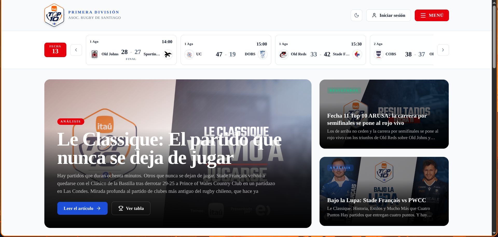

# 🏉 Rugby Chile — Itaú Top 10

**Rugby Chile — Itaú Top 10** is an unofficial live portal for Chile's top-flight
rugby-union league (ARUSA Primera División): live standings, results, fixtures,
player stats, news, a fantasy game, and — the centerpiece — a **Monte Carlo
season-projection model** (50k simulations, walk-forward backtest, coordinate-descent
calibration on log-loss). Next.js + Fastify monorepo; data comes from the league's
public feeds (Leverade + arusa.cl).

**Live demo:** **https://top10chile.vercel.app** (Vercel + Render + Neon — ver [`DEPLOY.md`](./DEPLOY.md)).



_(El resto del README está en español.)_

---

## El modelo de proyección — lo más interesante del proyecto

`/proyeccion` corre una **simulación de Monte Carlo** de lo que resta de temporada
(**50.000 simulaciones**) para estimar posiciones finales y probabilidad de título,
top-4 (playoffs), repechaje y descenso.

- **Motor de partido** (`api/src/services/modelCore.ts`): modelo aditivo determinista
  de ataque/defensa + ventaja de localía + head-to-head, **compartido** por producción,
  backtest y validación para que las tres nunca diverjan.
- **Backtest walk-forward** sin fuga de datos: cada fecha se predice usando solo lo
  jugado hasta ahí.
- **Calibración por coordinate-descent sobre log-loss**, con parámetros _pinned_
  (decisiones editoriales que el optimizador no puede pisar, p. ej. `h2hWeight`).

```bash
cd api
npm run backtest       # corre el backtest y reporta accuracy / log-loss
npm run recalibrate    # propone nuevos pesos (dry-run); --write para aplicar
```

La vista **"Aciertos del modelo"** es un termómetro read-only: compara lo proyectado
vs. lo real, pero **no** re-calibra sola. La re-calibración se hace a mano con
`npm run recalibrate` (recomendado cada 3-4 fechas, para no sobreajustar ruido).

---

## Arquitectura

Monorepo con **npm workspaces**. El web nunca toca la base de datos: todo pasa por la API.

```
rugby-chile/
├── web/     Next.js (App Router) — frontend + SSR. Puerto 3000.
├── api/     Fastify + Socket.IO — datos, scraping, modelo, live. Puerto 4000.
└── package.json  (workspaces: web, api)
```

| Capa | Stack |
|---|---|
| **Web** | Next.js, React, Tailwind, shadcn/base-ui, TanStack Query, Zustand, socket.io-client, next-auth |
| **API** | Fastify, Socket.IO, Drizzle ORM (Postgres), node-cron, zod |
| **DB** | PostgreSQL (Neon en prod) — cache de arusa, historial, fantasy, auth, live_matches |

> Convenciones de desarrollo (incluida una nota importante sobre la versión de Next.js
> de este repo): ver [`web/AGENTS.md`](./web/AGENTS.md).

---

## Fuentes de datos y atribución

Todo lo que consumimos es **público y sin autenticación**:

- **Metadata de partidos** (fechas, rivales, `finished`): API JSON de **Leverade**
  (`api.leverade.com`, torneo `1328550`, 3 grupos = 3 divisiones).
- **Marcadores**: se scrapean de la página server-rendered de **arusa.cl**
  (`/match/{id}/results`) — el JSON de Leverade no expone scores.
- **Timeline minuto-a-minuto / tries / tarjetas**: tab `minute_by_minute` de arusa
  (replica lo que hace el navegador anónimo en la página pública — sin bypass de auth).
- **Tabla de posiciones y estadísticas de jugadores**: scrape del ranking de arusa.
- **Noticias**: RSS (rugbiers.cl) + scraping de arusa, cada 6 h.
- **Nóminas / formaciones**: **carga manual** por un admin (endpoint autenticado +
  editor en `/admin/lineups`, con modo "pegar texto" que parsea la nómina).
  Opcionalmente se guarda el link al post público del club como fuente.

**arusa rate-limitea por IP (HTTP 429)** cuando se le piden muchas páginas seguidas.
Por eso el scrape de marcadores: sirve de cache lo ya capturado (memoria + tabla
`arusa_cache`; el marcador final es inmutable → se guarda para siempre), solo pide un
puñado de partidos nuevos por llamada (fechas recientes primero), reintenta ante 429 con
backoff (circuit breaker) y pone en cooldown los partidos sin marcador. Así el backfill
de una temporada se completa solo en unos ciclos de 60 s y sobrevive a caídas de arusa.

> **Atribución.** Los datos son propiedad de **ARUSA** (Asociación de Rugby de Santiago)
> y **Leverade/Clupik**. Este es un proyecto **sin fines de lucro, sin publicidad y no
> afiliado** a la liga ni a sus proveedores, hecho por un hincha con fines informativos.
> Todo scraper se identifica con un User-Agent propio que enlaza a este repo y respeta
> `robots.txt`. Si algún titular de los datos quiere que se baje algo, se hace.

---

## Puesta en marcha local

**Requisitos:** Node 20+, npm, y un PostgreSQL accesible (local o Neon).

```bash
# 1. Instalar dependencias (workspaces)
npm install

# 2. Variables de entorno
cp api/.env.example api/.env       # DATABASE_URL, PORT, WEB_URL, JWT_SECRET
cp web/.env.example web/.env.local # DATABASE_URL, NEXTAUTH_*, NEXT_PUBLIC_API_URL

# 3. Crear las tablas (una vez)
cd api && npm run db:push && cd ..

# 4. Levantar web + api juntos
npm run dev
```

- Web → http://localhost:3000
- API → http://localhost:4000 (health en `/health`, rutas en `/api/v1/*`)

La API, al arrancar, sincroniza arusa, reconstruye el historial del modelo y agenda los
cron jobs (poller de scores los fines de semana, noticias). Los datos de la liga llegan
solos; las nóminas se cargan a mano desde `/admin/lineups`.

---

## Scripts

**Raíz**

| Comando | Qué hace |
|---|---|
| `npm run dev` | Web + API en paralelo (concurrently) |
| `npm run build` | Build de web y api |
| `npm run test` | Tests de web y api (vitest) |

**API** (`cd api`)

| Comando | Qué hace |
|---|---|
| `npm run dev` | Fastify con `tsx watch` (hot reload) |
| `npm run build` / `start` | Compila TS / corre el build |
| `npm run backtest` | Backtest walk-forward del modelo |
| `npm run recalibrate` | Propone/aplica nuevos pesos (`--write`) |
| `npm run db:push` / `db:studio` | Drizzle: crear tablas / GUI |

**Web** (`cd web`)

| Comando | Qué hace |
|---|---|
| `npm run dev` | Next.js dev |
| `npm run build` / `start` | Build / servir prod |
| `npm run test` | vitest |
| `npm run lint` | eslint |

---

## Variables de entorno

**API** (`api/.env`)

| Var | Uso |
|---|---|
| `DATABASE_URL` | Postgres (Neon en prod) |
| `PORT` | Puerto de la API (default 4000) |
| `WEB_URL` | Origen permitido por CORS |
| `JWT_SECRET` | **Obligatorio** — firma los cookies de sesión (la API no arranca sin él) |

**Web** (`web/.env.local`)

| Var | Uso |
|---|---|
| `NEXT_PUBLIC_API_URL` | URL de la API |
| `NEXTAUTH_URL` / `NEXTAUTH_SECRET` | next-auth |
| `DATABASE_URL` | Solo si se usan features de DB en el web |
| `SEED_ADMIN_EMAIL` | Email del admin a crear con `db:seed` (si falta, no se crea admin) |

---

## Deploy

Stack gratis (Vercel web + Render API + Neon Postgres). Paso a paso en
[`DEPLOY.md`](./DEPLOY.md). El web solo necesita apuntar `NEXT_PUBLIC_API_URL` a la API.

---

## Notas

- Fixture y reglamento de ARUSA están hardcodeados en `web/src/lib/tournament.ts` y
  `web/src/app/reglamento/page.tsx` (el estado de cada partido se deriva de la fecha; una
  fecha suspendida por lluvia se marca con `postponed`).
- Posiciones de jugadores en el fantasy: ver [`POSICIONES.md`](./POSICIONES.md).
- Convenciones de desarrollo y la nota sobre Next.js: [`web/AGENTS.md`](./web/AGENTS.md).
